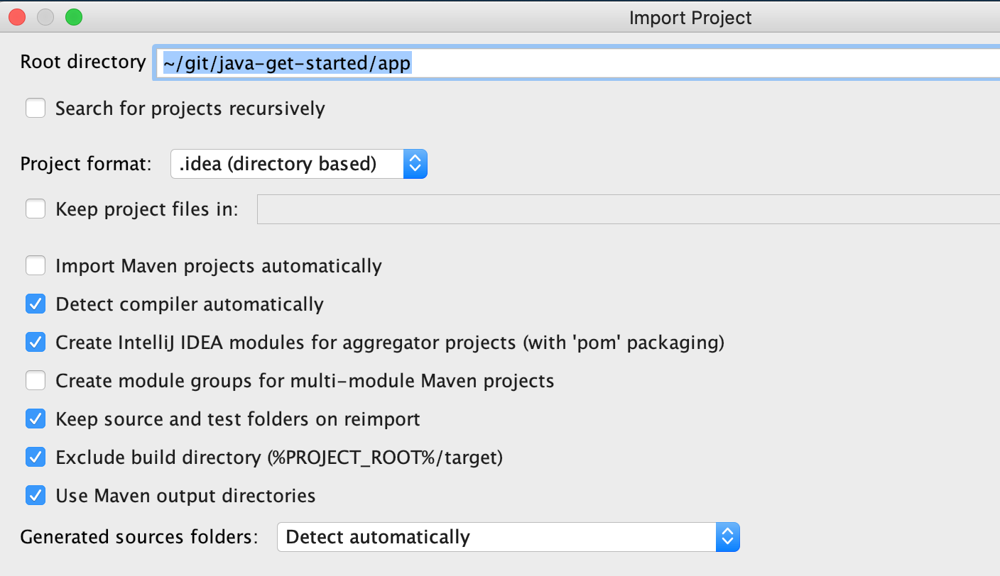

# java-get-started

学习 Java 的范例。

## 示例

## 依赖

- Git and Linux Bash, you can use Git bash on Windows.

- [Amazon Corretto JDK 8](https://aws.amazon.com/cn/corretto/)

- [Maven 3.x](http://maven.apache.org/)

- [InteliJ IDEA](https://www.jetbrains.com/idea/) (使用社区免费版或付费专业版都可以)

## 运行

- 生成 IDEA 项目描述文件

```
./scripts/gen-idea.sh
```



- 导入 IDEA

## 开源许可协议

Copyright 2019 Chatopera Inc. <https://www.chatopera.com>

Licensed under the Apache License, Version 2.0 (the "License");
you may not use this file except in compliance with the License.
You may obtain a copy of the License at

    http://www.apache.org/licenses/LICENSE-2.0

Unless required by applicable law or agreed to in writing, software
distributed under the License is distributed on an "AS IS" BASIS,
WITHOUT WARRANTIES OR CONDITIONS OF ANY KIND, either express or implied.
See the License for the specific language governing permissions and
limitations under the License.
